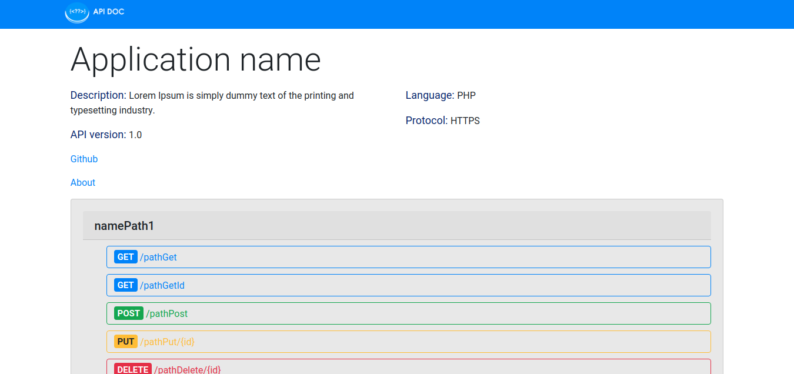

# Introduction

ApiDoc is a template made in HTML, PHP and Jquery to assist with PHP REST API documentation.
 


### Installation

Copy the link below to your command line to download the latest version. ApiDoc does not need to be installed on your machine, just clone the file and unzip it to the server folder.

```sh
$ git clone -b 1.2.0 --single-branch https://github.com/brennoDuarte/ApiDoc.git ApiDoc-v1.2.0-stable
```

Make sure JavaScript is enabled in your browser.

### Configure

You can edit the file "config.json" as follows:

- **"appName"**: your project name,
- **"version"**: your project version,
- **"description"**: a brief description of your api,
- **"language"**: the language in which your API was made,
- **"protocol"**: your api's protocol, HTTP or HTTPS,
- **"urls"**: API routes.

The **urls** session is subdivided into:
- **"namePath"**: name main route from your endpoint,
- **"id"**: modal id that will be displayed by clicking the route button. Remember to edit a different id for each endpoint, otherwise the id will not be displayed,
- **"pathGet/GetId/Post/Put/Delete"**: endpoints of your API,
- **"descriptionGet/Post/Put/Delete"**: a brief description of your endpoint,
- **"link"**: link from your endpoint. Clicking it will open in a new tab.

To add a new path, copy from "namePath" into the "config.json" file and paste it below the other paths.

If your api does not have a certain request, change the field to null. Example: 

```sh
"post": {
    "id": null,
    "pathPost": null,
    "descriptionPost": null,
    "link": null
},
```

Done, just open the **apidoc.php** file in any browse
